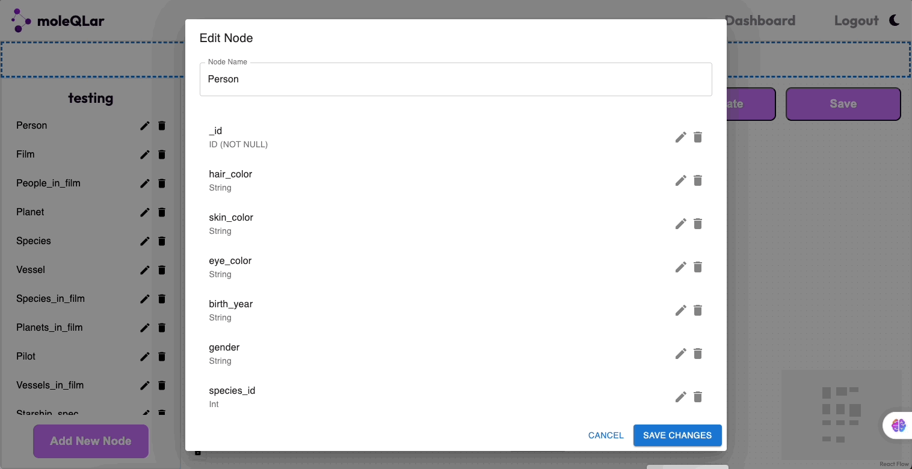
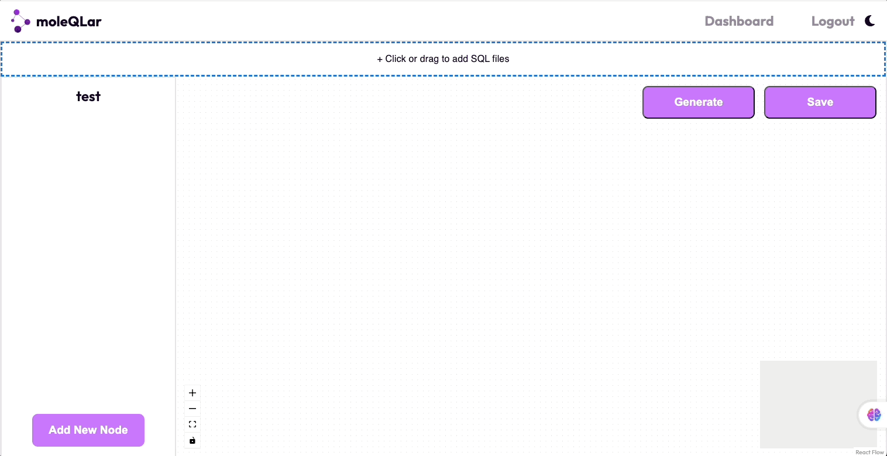

# MoleQLar

## Description

MoleQLar is a full-stack application that automatically generates GraphQL typedefs and resolver definitions for PostgreSQL databases. It provides a visual interface for uploading database schemas and modifying GraphQL types.

## Problem

Database schema analysis and GraphQL implementation currently face several challenges:

1. Database Complexity: Analyzing and understanding database structures can be complex and time-consuming.
2. Repetitive Tasks: Implementing GraphQL boilerplate code is often tedious and repetitive, whether working with an existing database or starting from scratch.
3. Lack of Visualization: It's difficult to visualize schema structures and the relationships between data, which can hinder understanding and development.

## Solution

MoleQLar addresses these challenges through the following features:

1. Node-Based GUI: Provides an intuitive interface for interacting with database schemas.
2. PostgreSQL to GraphQL Conversion: Automatically generates an interactive node-based graph from PostgreSQL database schema files.
3. SQL File Parser: Implements an algorithm to generate GraphQL Object Types and fields from SQL files.
4. Node-Based Graph: Visualizes GraphQL types and relationships, making it easier to understand complex schemas.
5. Authentication: Securely authenticates users and authorizes their access to database schemas and GraphQL query schemas.
6. Automatic Generation: Creates GraphQL resolvers and typeDefs based on the visualized schema.

These solutions aim to simplify the process of working with database schemas and implementing GraphQL, making development more efficient and less error-prone.

## Features

- User authentication (signup, login, logout)
- Database schema upload and visualization
- Interactive node graph editing
- Automatic generation of GraphQL typedefs and resolvers
- Project saving and retrieval
- Light/Dark mode settings

## Technologies Used

- Frontend: React, React Flow Renderer, MUI, SCSS
- Backend: Node.js, Express
- Database: PostgreSQL (with plans to migrate to MongoDB)
- Authentication: JWT
- Testing: Jest, React Testing Library
- Other: GraphQL, Docker, AWS Services, Webpack, React Router

## Usage

1. **Login/Sign Up**

   - Visit the MoleQLar website
   - If you're a new user, click "Sign Up" to create a new account
   - If you already have an account, log in

2. **Upload Database Schema**

   - After logging in, click the "Upload Schema" button
   - Select your PostgreSQL database schema SQL file
   - The system will automatically parse your schema and generate a visual node graph

3. **View and Edit Node Graph**

   - In the generated node graph, you can see your database tables and their relationships
   - Click on any node to view detailed information
   - Use the editing tools to modify node names or fields

   

4. **Generate GraphQL TypeDefs and Resolvers**

   - After editing the node graph, click the "Generate GraphQL" button
   - The system will automatically generate corresponding GraphQL TypeDefs and Resolvers
   - You can copy the generated code or download it as a file

   

5. **Save Project**

   - Name your project
   - Click the "Save Project" button to save your node graph and generated GraphQL code
   - You can return and continue editing your saved project at any time

6. **View Saved Projects**
   - On the main page, you can see all your saved projects
   - Click on any project name to reopen and continue working on it

Note: Ensure your database schema is correctly formatted for the best visualization and code generation results. If you encounter any issues during use, please refer to our documentation or contact our support team.

# Generating Database Schema SQL File

Before uploading your database schema to MoleQLar, you may need to generate a SQL file containing your schema. Here's how to do it using PostgreSQL:

## Prerequisites

Ensure you have PostgreSQL client tools installed on your system.

## Steps

1. Open a terminal and run the following command:

   ```sh
   pg_dump --username=your_username --host=your_host --port=your_port --dbname=your_database --schema-only --file=your_schema.sql
   ```

2. Replace the placeholders with your actual database connection details:

   - `your_username`: Your database username
   - `your_host`: The host address of your database
   - `your_port`: The port number (default is usually 5432)
   - `your_database`: The name of your database
   - `your_schema.sql`: The desired name for your output file

3. When prompted, enter your database password.

After the command completes, you should have a file named your_schema.sql in your current directory containing the database schema.

This SQL file can then be used with MoleQLar as described in the Usage section above.

> **Note:** Be careful not to share or commit your actual database credentials. It's recommended to use environment variables or a secure method to manage database connections in your application.

## Contributing

We welcome contributions to MoleQLar! If you'd like to contribute, please follow these steps:

1. Fork the repository on GitHub.
2. Clone your forked repository to your local machine.
3. Create a new branch for your feature or bug fix.
4. Make your changes and commit them with a clear, descriptive commit message.
5. Push your changes to your fork on GitHub.
6. Submit a pull request to the main MoleQLar repository.

### Guidelines

- Before starting work on a major feature or change, please open an issue to discuss it with the maintainers.
- Write clear, commented code and follow the existing code style.
- Include tests for new features or bug fixes.
- Update the documentation as necessary.
- Ensure your code lints without errors.

### Setting Up the Development Environment

1. Ensure you have Node.js and npm installed.
2. Navigate to the client folder and install dependencies:
   `cd client`
   `npm install`
3. Start the server in the client folder: `npm start`
4. Navigate to the server folder and install dependencies:
   `cd ../server`
   `npm install`
5. Start the server in the server folder: `npm start`

### Running Tests

Run the test suite with: `npm test`

### Reporting Bugs

If you find a bug, please open an issue on GitHub with a clear description of the problem and steps to reproduce it.

We appreciate your contributions to making MoleQLar better!

## Contact

For any questions or feedback about MoleQLar, please feel free to reach out to our team:

- Brian Yang: jibriyang91@gmail.com
- Dan Hudgens: danw.hudgens@gmail.com
- Erick Alvarez: erick505alvarez@gmail.com
- Jonathan Ghebrial: jony@ghebrial.com
- Mingzhu Wan: mingzhuwan@gmail.com

You can also find more information about our project on our [GitHub repository](https://github.com/oslabs-beta/moleQLar).
